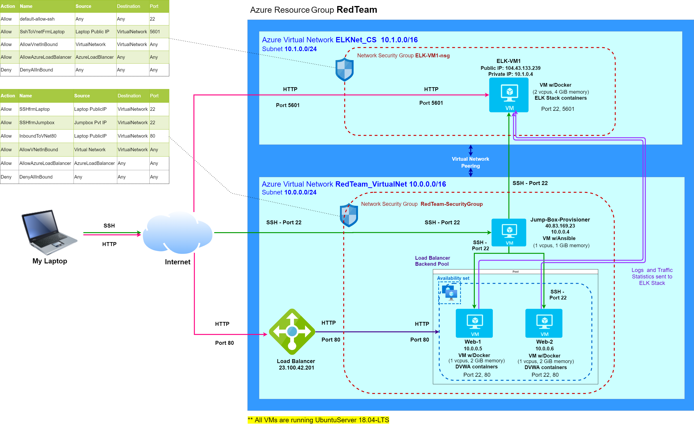
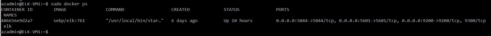
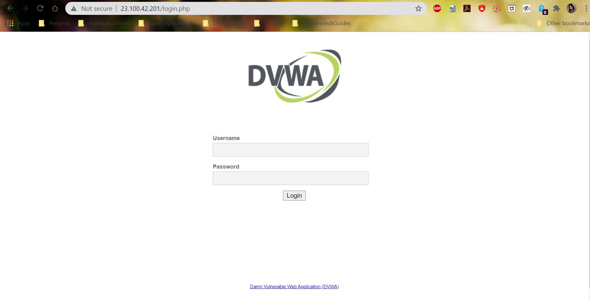
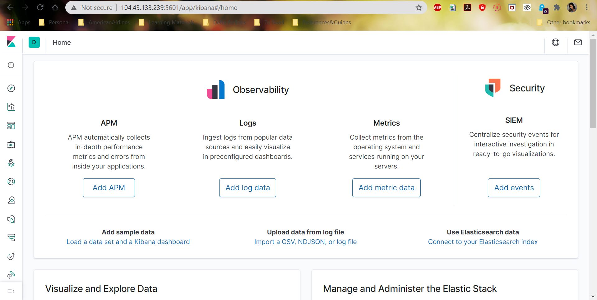

# Cloud Security
Note: This Github repository contains the projectwork documentation created as part of Cloud Security learning

## Automated ELK Stack Deployment

**The files in this repository were used to configure the network depicted below.**

The Ansible playbook files have been tested and was used to generate a live ELK deployment on Azure. They can be used to either recreate the entire deployment pictured above. Alternatively, select portions of the playbook files may be used to install only certain pieces of it, such as Filebeat.

  - [Playbook: DVWA Installation](Ansible_Playbooks/installdvwa-playbook.yml)
  - [Playbook: ELK Installation](Ansible_Playbooks/installelk-playbook.yml)
  - [Playbook: Filebeat Installation](Ansible_Playbooks/filebeat-playbook.yml)
  - [Playbook: Metricbeat Installation](Ansible_Playbooks/metricbeat-playbook.yml)

 

This document contains the following details:
- [Description of the Topology](#description-of-the-topology)
- [Access Policies](#access-policies)
- [ELK Configuration](#elk-configuration)
- [Target Machines & Beats](#target-machines-and-beats)
- [How to Use the Ansible Build](#using-the-playbooks)

 

### Description of the Topology

The main purpose of this network is to expose a load-balanced and monitored instance of DVWA, the D*mn Vulnerable Web Application.

Load balancing ensures that the application will be highly available, in addition to restricting huge traffic volume to the network. A **Load balancer** intelligently distributes traffic from clients across multiple servers without the clients having to understand how many servers are in use or how they are configured. Because the load balancer sits between the clients and the servers it can enhance the user experience by providing additional security, performance, resilience and simplify scaling your website

- In this scenario, the load balancer distributes the incoming HTTP traffic between the webservers (nodes or backend pool members), thus ensuring that the individual webservers and the network is not overwhelmed by huge volume of incoming HTTP traffic. This not only ensures that the web application, hosted on the webservers, provides a smooth running experience to the user, but it also helps prevent Denial-of-Service (DoS) or Distributed-Denial-of-service (DDoS) attacks.

\
A **Jumpbox** is a secure computer that all admins first connect to before launching any administrative task or use as an organization point to connect to other servers or untrusted environments. It is an intermediary host or an SSH gateway to a remote network, through which a connection can be made to another host. 

- In this scenario, the jumpbox serves as the entry point while connecting to the *Azure Virtual Machines (VMs)* from the local workstation on on-premise network. This helps to keep open only one port instead of several ports to connect to different VMs configured on this network, thus limiting the attack surface and preventing the VMs from being exposed to the public.

- Additionally, the jumpbox has been linked to a *Network Security Group*, thus further limiting the access to the jumpbox to specific IPs. In the scenario shown in the network diagram, the access to jumpbox is restricted only to the local workstation IP.

\
Integrating an **ELK server** allows users to easily monitor the vulnerable VMs for changes to the traffic pattern and system statistics.
- ***Filebeat*** monitors the log files and collects log events, and forwards them either to Elasticsearch or Logstash for indexing
- ***Metricbeat*** records system-level CPU usage, memory, file system, disk IO, and network IO statistics, as well as top-like statistics for every process running on your systems

\
**The configuration details of each machine may be found below:**

| Name         | Function | IP Address | Operating System |
|--------------|----------|------------|------------------|
| Jump Box     | Gateway  | Public IP:40.83.169.23   | Linux            |
| Jump Box     | Gateway  | Private IP: 10.0.0.4   | Linux            |
| Web-1        | DVWA     | 10.0.0.5   | Linux            |
| Web-2        | DVWA     | 10.0.0.6   | Linux            |
| Load Balancer| Balances traffic between webservers     | 23.100.42.201   | Linux            |
| ELK-VM1      | ELK Server | 10.1.0.4 | Linux            |

 

### Access Policies

The webservers on the internal network are not exposed to the public Internet. Only the jumpbox machine, ELK server and load balancer can accept connections from the Internet. Access to these machine is only allowed from the following IP addresses: ***My Laptop's Public IP***
- The jumpbox VM can be accesed via port 22 and SSH keys using the jumpbox server's IP 40.83.169.23.
- The ELK server's ***Kibana application*** can be accessed via port 5601 through its own public IP address 104.43.133.239
- ELK server can be accessed from the jumpbox VM via port 22 and SSH keys using the ELK servers private IP address 10.1.0.4  

\
The webservers within the network can only be accessed by the public IP address of our load balancer.
- The webservers's ***DVWA application*** is accessed via port 80 of the load balancer's public IP address ***23.100.42.201***
- The webservers  can be accessed from the jumpbox VM via port 22 and SSH keys using the webservers' private IP address : ***10.0.0.5 to SSH into Web-1 server*** and ***10.0.0.6 to SSH into Web-2 server***.

\
**A summary of the access policies in place can be found in the table below.**

| Name     | Publicly Accessible | Allowed IP Addresses |
|----------|---------------------|----------------------|
| Jump Box (SSH over port 22) | Yes                 | Laptop public IP     |
| Web-1    | No                  | 10.0.0.4              |
| Web-2    | No                  | 10.0.0.4             |
| Load Balancer (DVWA application)   | Yes                  | Laptop public IP        |
| ELK Server (Kibana application) | Yes            | Laptop public IP |
| ELK Server (SSH over port 22) | No            | 40.83.169.23 (Jumpbox IP)|

 

### Elk Configuration

**Ansible** was used to automate configuration of the ELK machine. No configuration was performed manually, which is advantageous because it limits the possibility of human error and allows us to deploy identical configurations on multiple servers.
- Ansible is a simple automation language that is easy-to-learn, self-documenting and doesn’t require a grad-level computer science degree to read. The primary benefit of Ansible is that it allows IT administrators to automate their daily tasks. It can be used to update programs and configuration on hundreds of servers at once, but the process is the same whether you’re managing one computer or dozens. This frees the IT Administrators to focus on efforts that help deliver more value to the business by spending time on more important tasks. Also, Ansible is open source, which provides flexibility so users can find creative ways to adapt the product for their needs.

\
**The playbook implements the following tasks:**
1. *Installs docker.io* - It references the IP address listed under [elk] in ansible's hosts file to install docker on the target VM.
2. *Installs python3* - the Docker module uses python
3. *Installs docker module*
4. *Increases virtual memory* - A standard container does not have enough virtual memory to run an ELK container. For 2 DVWA machines, the suggested amount is 262144.
5. *Downloads and launches ELK web container* - Downloads and launches the ELK container, and lists the ports needed to access said container/application. The ports used in this case are - 5601, 9200 and 5044

 

**The following screenshot displays the result of running `docker ps` after successfully configuring the ELK instance.**

 

### Target Machines and Beats
This ELK server is configured to monitor the following machines:
- **Web-1 : 10.0.0.5**
- **Web-2 : 10.0.0.6**

\
We have installed the following Beats on these machines:
- **Filebeat**
- **Metricbeat**

\
These Beats allow us to collect the following information from each machine:
- **Filebeat** collects and sends syslogs and auditd logs to Kibana for easy monitoring
- **Metricbeat** records system-level CPU usage, memory, file system, disk IO, and network IO statistics

 

### Using the Playbooks
In order to use the playbook, you will need to have an Ansible control node already configured. Assuming you have such a control node provisioned: 

#### Using Playbook to install the DVWA application

SSH into the control node and follow the steps below:
- Copy the ***installdvwa-playbook.yml*** file to location ***/etc/ansible***.
- Update the ***hosts*** file to include the IP addresses of ***Web-1*** and ***Web-2*** VMs. 
  1. Use the following command to enter the *hosts* file in edit mode: `nano hosts`
  2. Uncomment the [webservers] header line.
  3. Add the internal IP address under the [webservers] header. 
     The code snippet will look as shown below:\
     ` [webservers]`\
     `10.0.0.6 ansible_python_interpreter=/usr/bin/python3`\
     `10.0.0.7 ansible_python_interpreter=/usr/bin/python3`
 - Change the Ansible configuration file to use your administrator account for SSH connections.
   1. Open the file with `nano /etc/ansible/ansible.cfg` and scroll down to the ***remote_user*** option. 
   2. Uncomment the ***remote_user*** line and replace root with your admin username using this format: -\
     `remote_user = <user-name-for-web-VMs>`
- Run the playbook with command `ansible-playbook installdvwa-playbook.yml` and navigate to url ***http://23.100.42.201:80/*** to check that the installation worked as expected. *(Here 23.100.42.201 is the Load Balancer Public IP)* You should be getting the below shown webpage.

 

 

#### Using Playbook to install the ELK application

SSH into the control node and follow the steps below:
- Copy the ***installelk-playbook.yml*** file to location ***/etc/ansible***.
- Update the ***hosts*** file to include the IP address of ***ELK-VM1*** VM. 
  1. Use the following command to enter the *hosts* file in edit mode: `nano hosts`
  2. Add an entry for the internal IP address of ELK-Server VM under the [webservers] header. 
     The code snippet will look as shown below:\
     ` [elkservers]`
     `10.1.0.4 ansible_python_interpreter=/usr/bin/python3`
 - Change the Ansible configuration file to use your administrator account for SSH connections.
   1. Open the file with `nano /etc/ansible/ansible.cfg` and scroll down to the ***remote_user*** option. 
   2. Uncomment the ***remote_user*** line and replace root with your admin username using this format: -\
     `remote_user = <user-name-for-elk-VM>`
- Run the playbook with command `ansible-playbook installelk-playbook.yml` and navigate to url ***http://104.43.133.239:5601/app/kibana*** to check that the installation worked as expected. *(Here 104.43.133.239 is the ELK Server Public IP)* You should be getting the below shown webpage.

 

 

#### Beats Installations

  - [Instructions - Filebeat Installation](Beats_InstallGuides/InstallFilebeat.md)
  - [Instructions - Metricbeat Installation](Beats_InstallGuides/InstallMetricbeat.md)
