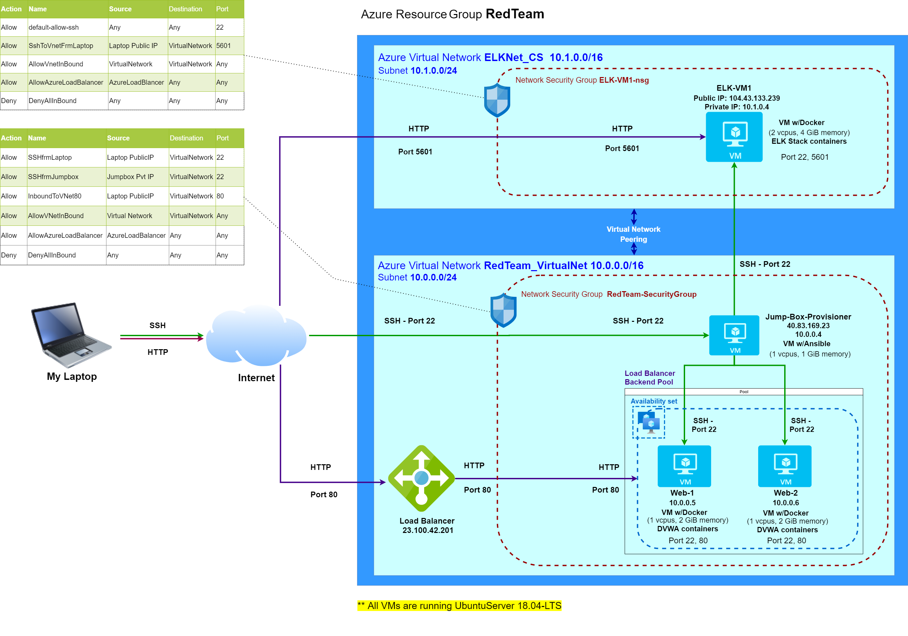

# Cybersecurity
Note: This Github repository contains the projectwork documentation created by me as part of CyberSecurity learning

## Automated ELK Stack Deployment

The files in this repository were used to configure the network depicted below.

The Ansible playbook files have been tested and was used to generate a live ELK deployment on Azure. They can be used to either recreate the entire deployment pictured above. Alternatively, select portions of the playbook files may be used to install only certain pieces of it, such as Filebeat.

  - [Playbook: DVWA Installation](Playbooks/installdvwa-playbook.yml)
  - [Playbook: ELK Installation](Playbooks/installelk-playbook.yml)
  - [Playbook: Filebeat Installation](Playbooks/filebeat-playbook.yml)
  - [Playbook: Metricbeat Installation](Playbooks/metricbeat-playbook.yml)

This document contains the following details:
- [Description of the Topology](#description-of-the-topology)
- [Access Policies](#access-policies)
- ELK Configuration
  - Beats in Use
  - Machines Being Monitored
- How to Use the Ansible Build

### Description of the Topology

The main purpose of this network is to expose a load-balanced and monitored instance of DVWA, the D*mn Vulnerable Web Application.

Load balancing ensures that the application will be highly available, in addition to restricting huge traffic volume to the network. A load balancer intelligently distributes traffic from clients across multiple servers without the clients having to understand how many servers are in use or how they are configured. Because the load balancer sits between the clients and the servers it can enhance the user experience by providing additional security, performance, resilience and simplify scaling your website

- In this scenario, the Load balancer distributes the incoming HTTP traffic between the webservers (nodes or backend pool members), thus ensuring that the individual webservers and the network is not overwhelmed by huge volume of incoming HTTP traffic. This not only ensures that the web application, hosted on the webservers, provides a smooth running experience to the user, but it also helps prevent Denial-of-Service (DoS) or Distributed-Denial-of-service (DDoS) attacks.

\
A jump box is a secure computer that all admins first connect to before launching any administrative task or use as an organization point to connect to other servers or untrusted environments. It is an intermediary host or an SSH gateway to a remote network, through which a connection can be made to another host. 

- In this scenario, the jumpbox serves as the entry point while connecting to the Azure Virtual Machines (VMs) from the local workstation on on-premise network. This helps to keep open only one port instead of several ports to connect to different VMs configured on this network, thus limiting the attack surface and preventing the VMs from being exposed to the public.

- Additionally, the jumpbox has been linked to a Network Security Group, thus further limiting the access to the jumpbox to specific IPs. In the scenario shown in the network diagram, the access to jumpbox is restricted only to the local workstation IP.

\
Integrating an ELK server allows users to easily monitor the vulnerable VMs for changes to the traffic pattern and system statistics.
- Filebeat monitors the log files and collects log events, and forwards them either to Elasticsearch or Logstash for indexing
- Metricbeat records system-level CPU usage, memory, file system, disk IO, and network IO statistics, as well as top-like statistics for every process running on your systems

\
The configuration details of each machine may be found below.

| Name         | Function | IP Address | Operating System |
|--------------|----------|------------|------------------|
| Jump Box     | Gateway  | 10.0.0.4   | Linux            |
| Web-1        | DVWA     | 10.0.0.5   | Linux            |
| Web-2        | DVWA     | 10.0.0.6   | Linux            |
| Load Balancer| Balances traffic between webservers     | 23.100.42.201   | Linux            |
| ELK-VM1      | ELK Server | 10.1.0.4 | Linux            |

\
### Access Policies

The webservers on the internal network are not exposed to the public Internet. Only the jumpbox machine, ELK server and load balancer can accept connections from the Internet. Access to these machine is only allowed from the following IP addresses: <My Laptop Public IP>
- The jumpbox VM can be accesed via port 22 and SSH keys using the jumpbox server's IP 40.83.169.23.
- The ELK server's Kibana application can be accessed via port 5601 through its own public IP address 104.43.133.239
- ELK server can be accessed from the jumpbox VM via port 22 and SSH keys using the ELK servers private IP address 10.1.0.4  

The webservers within the network can only be accessed by the public IP address of our load balancer.
- The webservers's DVWA application is accessed via port 80 of the load balancer's public IP address 23.100.42.201
- The webservers  can be accessed from the jumpbox VM via port 22 and SSH keys using the webservers' private IP address : 10.0.0.5 to SSH into Web-1 server and 10.0.0.6 to SSH into Web-2 server.

\
A summary of the access policies in place can be found in the table below.

| Name     | Publicly Accessible | Allowed IP Addresses |
|----------|---------------------|----------------------|
| Jump Box | Yes                 | 40.83.169.23         |
| Web-1    | No                  | 10.0.0.5             |
| Web-2    | No                  | 10.0.0.6             |
| Load Balancer (DVWA application)   | Yes                  | 23.100.42.201         |
| ELK Server (Kibana application) | Yes            | 104.43.133.239 |

### Elk Configuration

Ansible was used to automate configuration of the ELK machine. No configuration was performed manually, which is advantageous because...
- _TODO: What is the main advantage of automating configuration with Ansible?_

The playbook implements the following tasks:
- _TODO: In 3-5 bullets, explain the steps of the ELK installation play. E.g., install Docker; download image; etc._
- ...
- ...

The following screenshot displays the result of running `docker ps` after successfully configuring the ELK instance.

**Note**: The following image link needs to be updated. Replace `docker_ps_output.png` with the name of your screenshot image file.  

### Target Machines & Beats
This ELK server is configured to monitor the following machines:
- _TODO: List the IP addresses of the machines you are monitoring_

We have installed the following Beats on these machines:
- _TODO: Specify which Beats you successfully installed_

These Beats allow us to collect the following information from each machine:
- _TODO: In 1-2 sentences, explain what kind of data each beat collects, and provide 1 example of what you expect to see. E.g., `Winlogbeat` collects Windows logs, which we use to track user logon events, etc._

### Using the Playbook
In order to use the playbook, you will need to have an Ansible control node already configured. Assuming you have such a control node provisioned: 

SSH into the control node and follow the steps below:
- Copy the _____ file to _____.
- Update the _____ file to include...
- Run the playbook, and navigate to ____ to check that the installation worked as expected.

_TODO: Answer the following questions to fill in the blanks:_
- _Which file is the playbook? Where do you copy it?_
- _Which file do you update to make Ansible run the playbook on a specific machine? How do I specify which machine to install the ELK server on versus which to install Filebeat on?_
- _Which URL do you navigate to in order to check that the ELK server is running?

_As a **Bonus**, provide the specific commands the user will need to run to download the playbook, update the files, etc._
